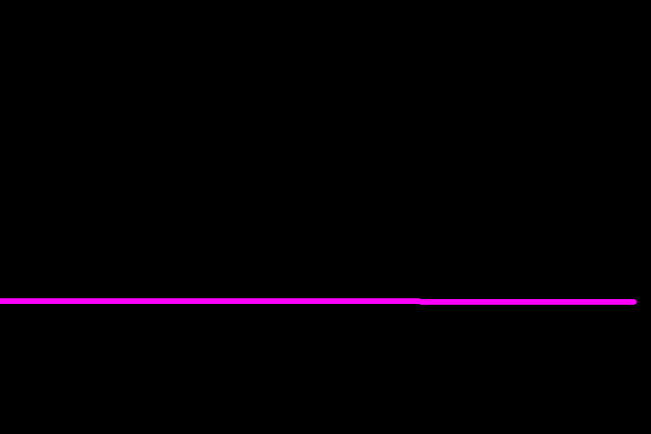
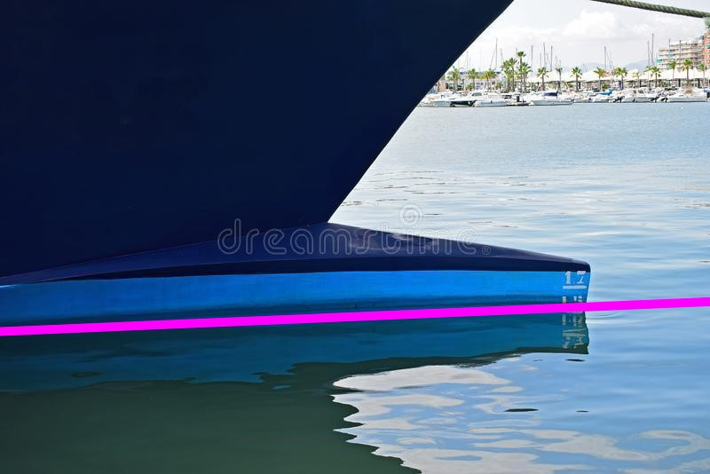
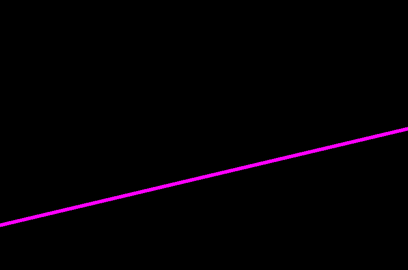
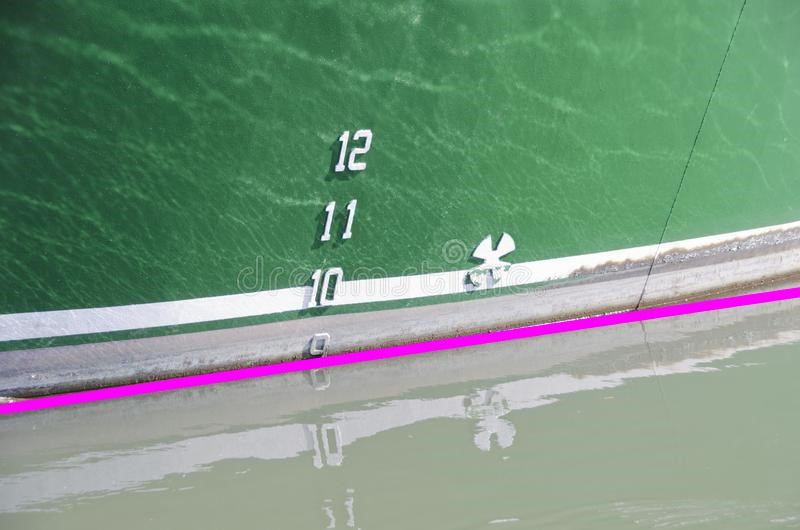
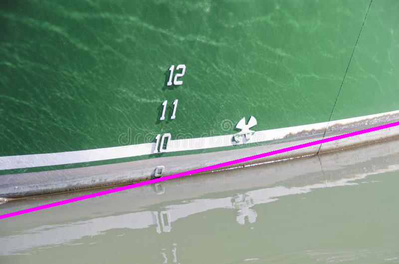
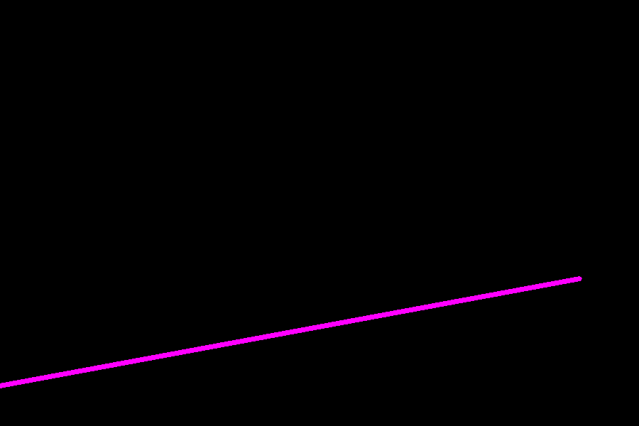
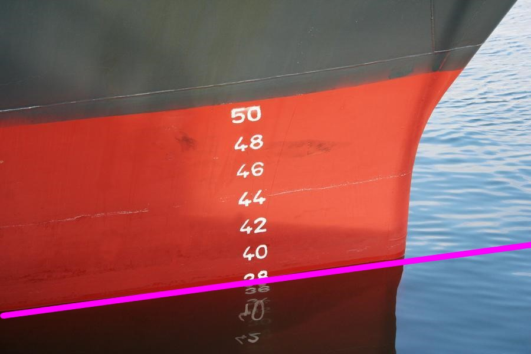
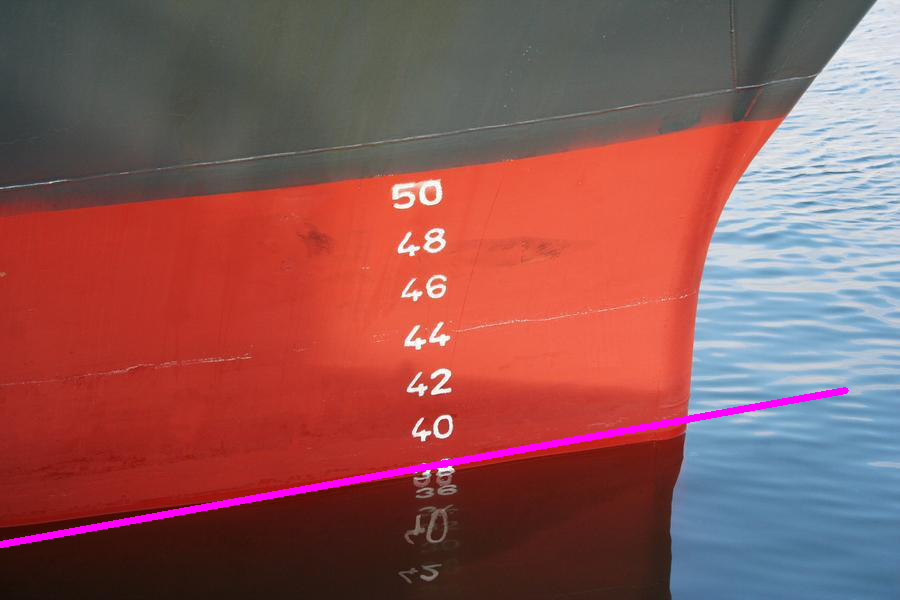

<center><h1>WaterlinePSPNet</h1>
</center>

# 环境配置
```
pip install -r requirement.txt
```

# 模型训练

## 数据集准备

本算法采用VOC数据集格式进行训练，数据集存放目录如下：

```shell
- ImageSets			
	- Segmentation
		- train.txt	# 训练集，文本每一行为图片前缀名
		- val.txt	# 验证集
- JPEGImages		# 存放所有图像
	- 1.jpg			
- SegmentationClass	# 存放所有标签
	- 1.png
```

## 配置文件

- 1、修改`utils/dataloader.py`中加载数据集的路径

- 2、检查`train.py`中网络配置参数是否正确。本算法提供的网络模型默认配置如下：

```python
model = PSPNet(num_classes=2, backbone='mobilenet_ca', downsample_factor=8, pretrained=True, aux_branch=True, skip_upsample=True).train() 
```

- 3、运行train.py即可开始训练。  


# 预训练模型

提供以下三种模型：

|         训练权重          |                    下载路径（提取码）                     |
| :-----------------------: | :-------------------------------------------------------: |
|    骨干网络预训练模型     | https://pan.baidu.com/s/1ItPHuhGaeMFKj3b_wT4VwA（`rkii`） |
|   VOC+SBD通用预训练模型   | https://pan.baidu.com/s/1ikRhKhxEovdvUsW1YYckRw（`d9u6`） |
| WaterlinePSPNet预训练模型 | https://pan.baidu.com/s/1jUdcv6UNkeKVwKmF3WkXkg（`sqqv`） |


# 模型测试

- 1、修改根目录下`pspnet.py`中加载预训练模型的路径和相应的参数：**model_path对应logs文件夹下面的权值文件，backbone是所使用的主干特征提取网络**。    

  ```python
  _defaults = {
      "model_path"        :   'model_data/best_model.pth',
      "model_image_size"  :   (473, 473, 3),
      "backbone"          :   "mobilenet_ca",
      "downsample_factor" :   8,
      "num_classes"       :   2,
      "cuda"              :   True,
      "blend"             :   True,
  }
  ```

- 2、运行`predict.py`，生成的预测存放在`results`文件夹下


# 模型评估

本算法需要进行两次评估，第一次使用mIoU和mPA评估分割模型的精度；为了验证后处理阶段中拟合水线的准确性，第二次使用直方图和Hu矩轮廓匹配对预测的拟合吃水线图像和实际吃水线图像进行评估

## 测试数据集准备

```shell
- test.txt				# 测试集，文本每一行为图片前缀名
- test_images			# 存放所有测试图像
	- 2.jpg
- test_labels			# 存放所有测试标签
	- 2.png
- blank_gt_waterline	# 实际的吃水线
- blank_pre_waterline	# 预测的吃水线
- raw-waterline			# 在原图上绘制了实际吃水线的图像
- pre-waterline			# 在原图上绘制了预测吃水线的图像
```

测试样例：

|                  实际的吃水线                   |                       预测的吃水线                       |                实际吃水线的图像                 |                       预测吃水线的图像                       |
| :---------------------------------------------: | :------------------------------------------------------: | :---------------------------------------------: | :----------------------------------------------------------: |
|   |   |   |  |
|  |  |  |      |
|  |  |  |      |


## 评估网络

- 1、运行`get_miou_prediction.py`，生成的预测二值图像mask存放在`miou_pr_dir`文件夹下
- 2、运行`miou.py`，计算mIoU和mPA
- 3、运行`waterline_metric.py`，计算直方图和Hu矩


## 模型性能

|      评估指标      | 评估结果 |
| :----------------: | :------: |
|     mIoU（%）      |  95.04   |
|      mPA（%）      |  97.36   |
|  直方图平均相似度  |  0.8483  |
| 直方图平均巴氏距离 |  0.0437  |
|    平均Hu矩距离    |  0.1408  |


# Reference

https://github.com/ggyyzm/pytorch_segmentation  
https://github.com/bonlime/keras-deeplab-v3-plus
